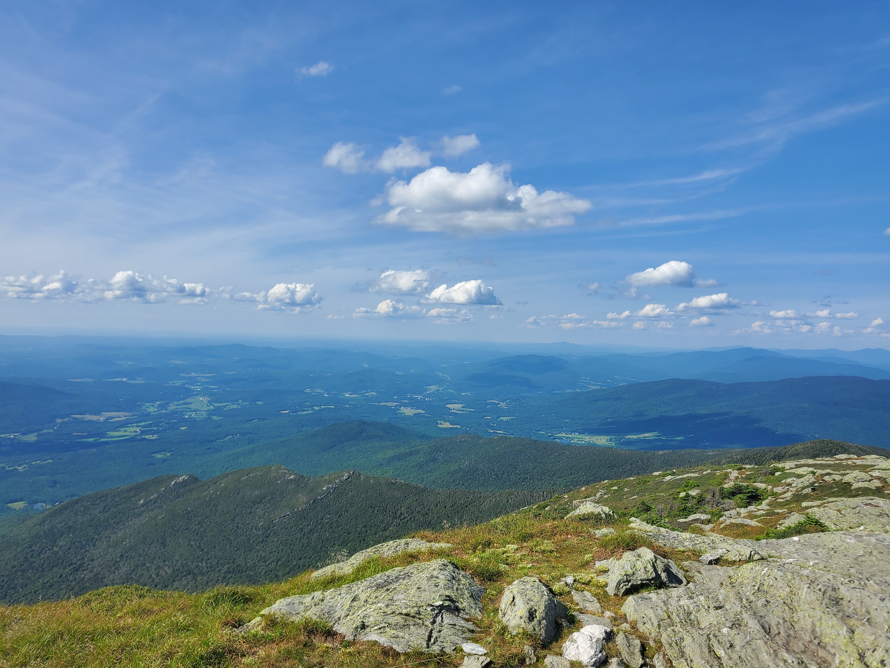

I'm a 2nd year PhD student in the Department of Environmental Health Sciences 
at Columbia University, Mailman School of Public Health.

I'm working under the mentorship of Drs. Marianthi-Anna Kioumourtzoglou and 
Diane Re. My research interests include characterizing the contribution of
environmental exposures implicated in the development of neurodegenerative
diseases, specifically amyotrophic lateral sclerosis (ALS). 

My current and upcoming projects include studying the association between 
residential air pollution exposure and ALS disease progression using the
Massachusetts ALS Registry and the Danish National Patient Registry. 

This is a website that I'm making for my homework for [p8105](https://www.p8105.com/making_websites.html).

